# 배우앤배움 관리자 사용 가이드

> 대상: 배우앤배움 사이트 운영 담당자
>
> 관리자 주소: `https://[운영 도메인]/admin`
>
> 기준 서비스: 배우앤배움 통합 사이트(Payload CMS)
>
> 문서 버전: v1.2
>
> 최종 갱신일: 2026-07-20

## 이 문서를 먼저 읽어 주세요

이 가이드는 관리자에서 콘텐츠를 등록하고 공개 사이트에서 확인하는 실제 업무 순서에 맞춰 작성했습니다. 관리자 계정의 역할과 담당 센터에 따라 보이는 메뉴와 수정 가능한 범위가 다를 수 있습니다.

- **센터매니저**는 본인 담당 센터의 콘텐츠를 관리하며, 일부 공용 설정도 수정할 수 있습니다.
- **센터 통합 매니저**와 **최고관리자**는 여러 센터의 콘텐츠를 관리할 수 있습니다.
- 입시센터, 하이틴센터, 아트센터 전용 메뉴는 관련 센터 계정과 통합 관리자에게만 보입니다.
- 삭제는 복구가 어려울 수 있습니다. 상태 필드가 있는 콘텐츠는 삭제 전에 **비공개**로 전환하고, 메인 배너는 **임시저장**으로 전환합니다. 상태 필드가 없는 공용 설정은 담당자와 확인한 뒤 삭제합니다.
- 저장 중에는 `저장 중입니다.` 화면이 사라질 때까지 브라우저를 닫거나 뒤로 이동하지 않습니다.

본문의 이미지 위치에는 아래 형식의 파일을 넣으면 됩니다. 캡처에는 이메일, 전화번호, 생년월일, 비밀번호, 첨부파일명 등 개인정보가 보이지 않도록 가립니다.

```text
deliverables/admin-guide/images/2-1.png
```

## 목차

1. [센터와 공개 주소](#1-센터와-공개-주소)
2. [관리자 접속과 계정](#2-관리자-접속과-계정)
3. [관리자 화면과 권한](#3-관리자-화면과-권한)
4. [콘텐츠 등록·수정 공통 흐름](#4-콘텐츠-등록수정-공통-흐름)
5. [이미지와 영상 관리](#5-이미지와-영상-관리)
6. [메인설정 관리](#6-메인설정-관리)
7. [회사정보 관리](#7-회사정보-관리)
8. [교육 콘텐츠 관리](#8-교육-콘텐츠-관리)
9. [캐스팅·오디션 콘텐츠 관리](#9-캐스팅오디션-콘텐츠-관리)
10. [아티스트 콘텐츠 관리](#10-아티스트-콘텐츠-관리)
11. [입시센터 후기·합격 콘텐츠 관리](#11-입시센터-후기합격-콘텐츠-관리)
12. [뉴스·FAQ·스타카드 관리](#12-뉴스faq스타카드-관리)
13. [상담 문의 관리](#13-상담-문의-관리)
14. [관리자 계정과 사이트 점검모드](#14-관리자-계정과-사이트-점검모드)
15. [발행 전 확인과 문제 해결](#15-발행-전-확인과-문제-해결)
16. [빠른 찾기](#16-빠른-찾기)
17. [화면 캡처 목록](#17-화면-캡처-목록)

---

## 1. 센터와 공개 주소

통합 사이트에서는 센터별 주소가 아래처럼 구분됩니다. 이 문서의 `{센터}`는 아래 영문 경로 중 하나를 뜻합니다.

| 센터 | 경로 | 공개 주소 예시 |
| --- | --- | --- |
| 아트센터 | `art` | `https://[운영 도메인]/art` |
| 입시센터 | `exam` | `https://[운영 도메인]/exam` |
| 키즈센터 | `kids` | `https://[운영 도메인]/kids` |
| 하이틴센터 | `highteen` | `https://[운영 도메인]/highteen` |
| 애비뉴센터 | `avenue` | `https://[운영 도메인]/avenue` |

콘텐츠를 저장한 뒤에는 관리자 화면만 확인하지 말고, 반드시 해당 센터의 공개 주소에서 실제 노출 결과를 확인합니다.

## 2. 관리자 접속과 계정

### 로그인

1. Chrome, Edge, Safari 등 최신 웹 브라우저에서 `https://[운영 도메인]/admin`에 접속합니다.
2. 전달받은 이메일과 비밀번호를 입력합니다.
3. 로그인 후 왼쪽 메뉴에서 관리할 항목을 선택합니다.

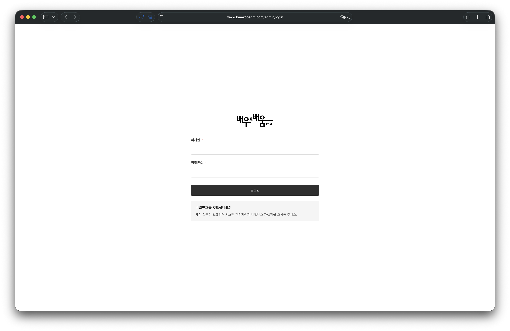

### 비밀번호를 잊은 경우

계정 접근이 필요하면 시스템 관리자에게 비밀번호 재설정을 요청합니다. 요청할 때는 **계정 이메일 주소**만 전달하고, 사용하던 비밀번호를 메신저나 문서로 보내지 않습니다.

### 계정 사용 원칙

- 계정은 담당자별로 사용하며 여러 사람이 하나의 계정을 공유하지 않습니다.
- 다른 센터의 콘텐츠가 보이더라도 담당 범위가 아닌 항목은 수정하지 않습니다.
- 담당자 변경 시 시스템 관리자에게 기존 계정의 권한 변경 또는 사용 중지를 요청합니다.
- 공용 PC에서는 작업 후 오른쪽 위 계정 메뉴에서 로그아웃합니다.

## 3. 관리자 화면과 권한

관리자 화면은 크게 왼쪽 메뉴, 목록 화면, 편집 화면으로 구성됩니다.

| 영역 | 용도 |
| --- | --- |
| 왼쪽 메뉴 | 관리할 콘텐츠 또는 설정을 선택합니다. |
| 목록 화면 | 콘텐츠를 검색·필터링하고 새 항목을 만듭니다. |
| 편집 화면 | 제목, 본문, 이미지, 센터, 상태 등을 입력하고 저장합니다. |
| 오른쪽 보조 영역 | 상태, 발행일, 작성자, 정렬순서 등 보조 정보를 확인합니다. |

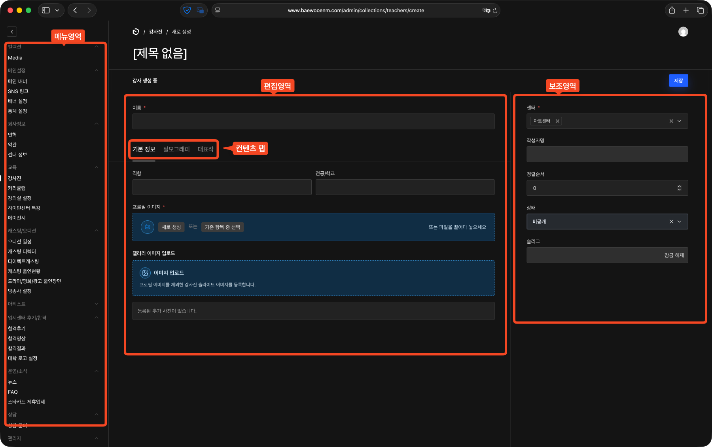

### 계정별 관리 범위

| 계정 역할 | 기본 관리 범위 |
| --- | --- |
| 최고관리자 | 전체 센터, 관리자 계정, 사이트 설정 |
| 센터 통합 매니저 | 전체 센터 콘텐츠 |
| 센터매니저 | 본인 담당 센터 콘텐츠, 일부 공용 설정 |

센터매니저는 본인 센터에 속한 콘텐츠를 수정할 수 있습니다. `ALL`로 지정된 공통 콘텐츠는 목록에서 보일 수 있지만 수정할 수 없습니다. 여러 센터가 함께 지정된 콘텐츠에 본인 센터가 포함되어 있으면 수정할 수 있으며, 저장한 변경사항은 선택된 모든 센터에 함께 반영됩니다.

**연혁, 약관, 강의실 설정, 방송사 설정, 미디어**는 여러 센터가 함께 사용하는 공용 항목입니다. 센터매니저에게 수정 권한이 표시되더라도 다른 센터에 영향을 줄 수 있으므로, 화면의 공용 설정 경고를 확인하고 담당자와 협의한 뒤 수정하거나 삭제합니다.

### 목록에서 콘텐츠 찾기

1. 메뉴를 선택합니다.
2. 제목, 이름, 학교명 등으로 검색합니다.
3. 필요한 경우 목록의 필터를 사용합니다.
4. 기존 항목이 있으면 제목을 눌러 수정하고, 없을 때만 **새로 만들기**를 선택합니다.

통합 관리자에게는 센터를 선택하는 **센터 빠른 필터**가 표시됩니다. 입시센터의 **합격결과** 목록에는 센터 필터 대신 `전체 / 대학교 / 예술고` 학교 필터가 표시됩니다.

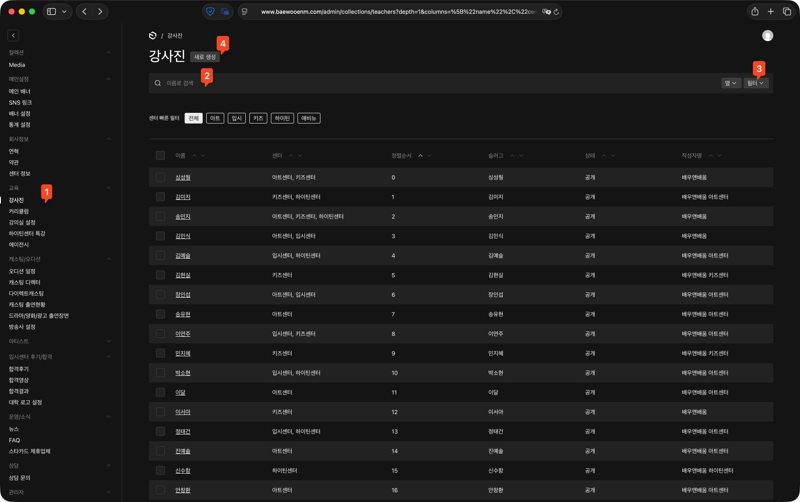

> 동일 인물, 학교, 방송사, 소속사 또는 같은 제목의 콘텐츠를 새로 만들기 전에 기존 항목을 먼저 검색합니다. 관계 항목이 중복되면 이후 선택 목록과 공개 화면 관리가 어려워집니다.

## 4. 콘텐츠 등록·수정 공통 흐름

### 새 콘텐츠 등록

1. 왼쪽 메뉴에서 콘텐츠 종류를 선택합니다.
2. 목록 오른쪽 위의 **새로 만들기**를 선택합니다.
3. 제목이나 이름처럼 항목을 구분하는 값을 먼저 입력합니다.
4. 콘텐츠 탭의 본문, 이미지, 관계 항목을 입력합니다.
5. 오른쪽 보조 영역에서 **센터**, **상태**, **발행일**을 확인합니다.
6. **저장**을 선택합니다.
7. `저장 중입니다.` 화면이 사라지고 저장 완료 안내가 표시되는지 확인합니다.
8. 공개 사이트의 해당 센터 목록과 상세 화면을 확인합니다.

### 기존 콘텐츠 수정

1. 목록에서 검색 또는 필터로 항목을 찾습니다.
2. 제목을 선택해 편집 화면을 엽니다.
3. 현재 센터와 상태를 먼저 확인합니다.
4. 필요한 값만 수정하고 저장합니다.
5. 공개 사이트에서 수정한 위치를 다시 확인합니다.

### 상태의 의미

대부분의 공개 콘텐츠에는 다음 상태가 있습니다. 메뉴마다 새 항목의 기본 상태가 다르므로 저장 전에 반드시 직접 확인합니다.

| 상태 | 공개 사이트 노출 |
| --- | --- |
| 임시저장 | 노출하지 않고 작성 중인 상태로 둡니다. |
| 공개 | 선택한 센터의 공개 사이트에 노출합니다. |
| 비공개 | 기존 콘텐츠를 공개 사이트에서 숨깁니다. |

`저장`은 입력값을 보관하는 동작이고, 공개 여부는 **상태**가 결정합니다. 저장 버튼을 눌렀다는 이유만으로 항상 공개되는 것은 아닙니다.

### 발행일·등록일·수정일

- **발행일**은 공개 목록의 날짜나 정렬 기준으로 사용될 수 있습니다.
- **등록일**은 관리자에 처음 생성된 날짜입니다.
- **수정일**은 마지막 저장 시각입니다.
- 과거 콘텐츠를 수정할 때 발행일을 오늘로 바꾸면 목록 순서가 달라질 수 있으므로 의도한 경우에만 변경합니다.

### 센터 선택

- 한 센터에서만 사용할 콘텐츠는 해당 센터만 선택합니다.
- 여러 센터에 같은 콘텐츠를 노출해야 할 때만 여러 센터 또는 `ALL`을 사용합니다.
- 센터매니저 계정은 담당 센터가 자동 적용되거나 다른 센터 선택이 제한될 수 있습니다.
- 여러 센터가 지정된 기존 콘텐츠를 수정하면 선택된 모든 센터에 변경사항이 함께 반영됩니다.
- 콘텐츠의 센터를 옮기면 이전 센터와 새 센터의 공개 화면을 모두 확인합니다.

### 필수값 오류가 표시되는 경우

저장 후 탭 이름이나 필드에 빨간 오류 표시가 나오면 해당 탭을 열어 안내 문구를 확인합니다. 오류가 남아 있는 동안은 저장이 완료되지 않은 상태입니다.

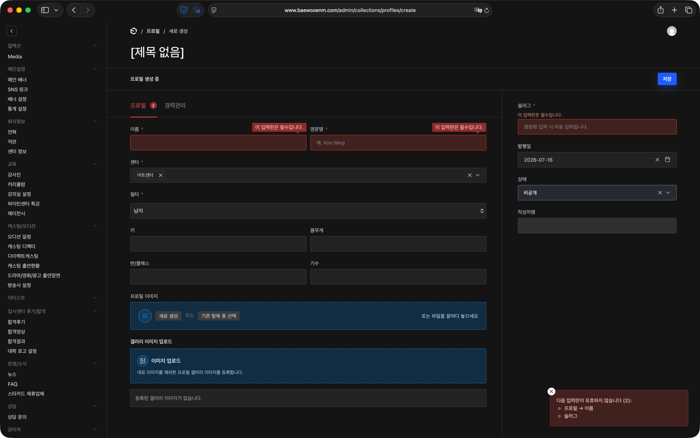

## 5. 이미지와 영상 관리

### 기본 업로드 기준

| 구분 | 기준 |
| --- | --- |
| 이미지 용량 | 파일당 2MB 이하 |
| 지원 이미지 | JPEG/JPG, PNG, WebP, GIF, AVIF |
| 지원 영상 | MP4, WebM |
| 파일 준비 | 공개 화면에 맞게 리사이즈·압축한 운영본 사용 |

파일 확장자만 바꾼 파일은 업로드되지 않습니다. 원본 프로그램이나 이미지 편집 도구에서 지원 형식으로 다시 저장한 뒤 업로드합니다.

### 대표 이미지 권장 크기

| 사용 위치 | 권장 크기 |
| --- | ---: |
| 메인 배너 데스크톱 | 1920×1080px |
| 메인 배너 모바일 | 750×1062px |
| 다이렉트캐스팅 대표 이미지 | 536×760px 이상 |
| 드라마/영화/광고 출연장면 대표 이미지 | 1120×620px 이상 |
| 출신 아티스트 대표 이미지 | 600×450px 이상 |
| 방송사·소속사·학교 로고 | 400×400px 이상 정사각형 |

권장 크기보다 큰 이미지는 같은 비율로 준비하고, 등록 후 PC와 모바일에서 잘리는 영역이 없는지 확인합니다.

### 이미지 필드 유형 확인

관리자 이미지 필드는 아래 두 방식으로 동작합니다. 화면에 보이는 버튼에 맞는 절차를 사용합니다.

- **미디어 선택 필드**는 기존 미디어를 검색해 재사용하거나 새 파일을 업로드할 수 있습니다.
- **직접 업로드 필드**는 파일을 선택하거나 끌어다 놓아 바로 업로드합니다. 합격후기 학생 이미지, 합격결과 대표 이미지, 캐스팅 출연현황 대표 이미지 등이 이 방식이며 기존 미디어 검색은 지원하지 않습니다. 업로드 완료 메시지를 확인한 뒤 콘텐츠 자체를 저장해야 반영됩니다.

### 이미지 선택 필드에서 업로드

1. 이미지 필드의 **선택** 또는 **업로드**를 누릅니다.
2. 기존 이미지가 있으면 검색해 재사용합니다.
3. 새 이미지가 필요하면 파일을 업로드합니다.
4. 미리보기와 파일명을 확인합니다.
5. 원래 콘텐츠 편집 화면으로 돌아와 이미지가 선택된 상태인지 확인합니다.
6. 콘텐츠 자체를 저장합니다.

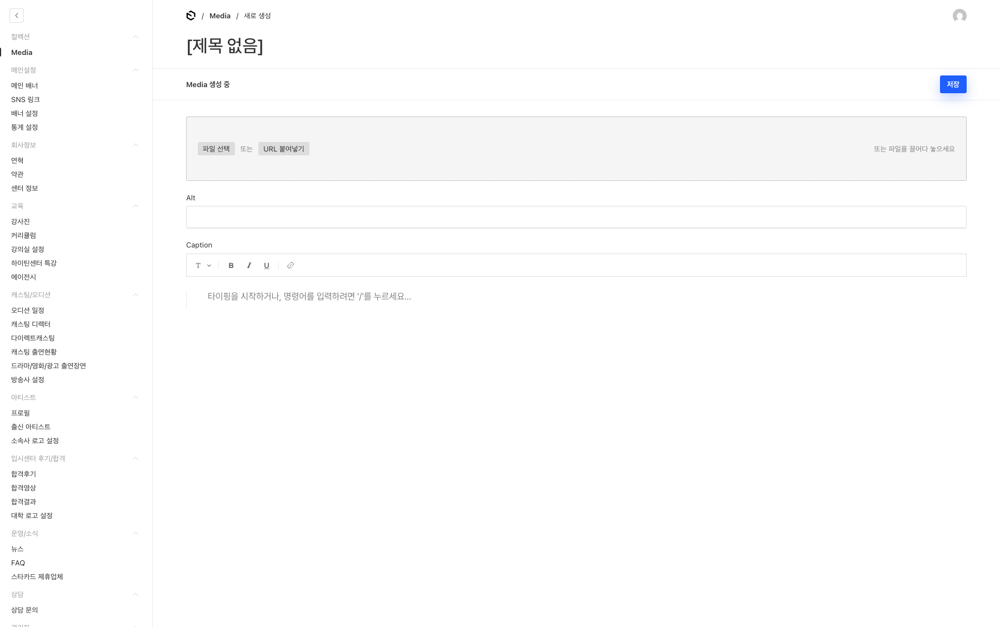

### 이미지 작성 원칙

- 인물 사진은 얼굴이 잘리지 않는지 PC와 모바일에서 확인합니다.
- 투명 배경이 필요한 학교·방송사·소속사 로고는 가능하면 투명 PNG 또는 WebP를 사용합니다.
- 텍스트가 들어간 배너는 모바일 이미지도 별도로 준비하는 것을 권장합니다.
- 미디어 선택 필드에서는 같은 이미지를 여러 번 올리지 말고 기존 미디어를 검색해 재사용합니다.
- 이미지 설명을 입력할 수 있는 경우 화면에 보이는 대상을 짧고 정확하게 적습니다.
- 갤러리·본문 이미지 업로드 후 콘텐츠를 저장하지 않고 나가면 업로드 파일이 콘텐츠에 연결되지 않을 수 있습니다.

### 메인 배너 영상 권장 기준

| 영상 | 권장 용량 | 권장 형태 |
| --- | ---: | --- |
| 데스크톱 영상 | 20MB 이하 | 10초 내외, 무음 반복용 MP4/WebM |
| 모바일 영상 | 10MB 이하 | 10초 내외, 무음 반복용 MP4/WebM |

메인 배너 영상의 포스터는 같은 화면의 이미지 필드를 사용합니다. 모바일 영상을 비워두면 데스크톱 영상이 모바일에도 사용되고, 모바일 이미지를 비워두면 데스크톱 이미지가 모바일에도 사용됩니다.

## 6. 메인설정 관리

메인설정에는 **메인 배너**, **SNS 링크**, **배너 설정**, **통계 설정**이 있습니다.

### 6-1. 메인 배너 등록

1. **메인설정 → 메인 배너**를 선택합니다.
2. **새로 만들기**를 선택합니다.
3. `내용` 탭에서 **제목**과 **센터**를 입력합니다.
4. 화면에 표시할 **타이틀**과 **설명**을 입력합니다.
5. `미디어` 탭에서 **데스크톱 이미지**를 반드시 선택합니다.
6. 필요하면 모바일 이미지, 데스크톱 영상, 모바일 영상을 추가합니다.
7. `연결 콘텐츠` 탭에서 센터에 맞는 콘텐츠를 연결합니다.
8. 오른쪽에서 **상태**와 예약 여부를 확인한 뒤 저장합니다.
9. 해당 센터 메인 화면에서 PC와 모바일을 확인합니다.

데스크톱 이미지는 **1920×1080px**, 모바일 이미지는 **750×1062px**를 권장합니다.

새 배너는 저장 시 해당 센터의 배너 순서 맨 앞에 자동으로 추가됩니다. 원하는 위치가 다르면 다음 절의 **배너 설정**에서 순서를 조정합니다.

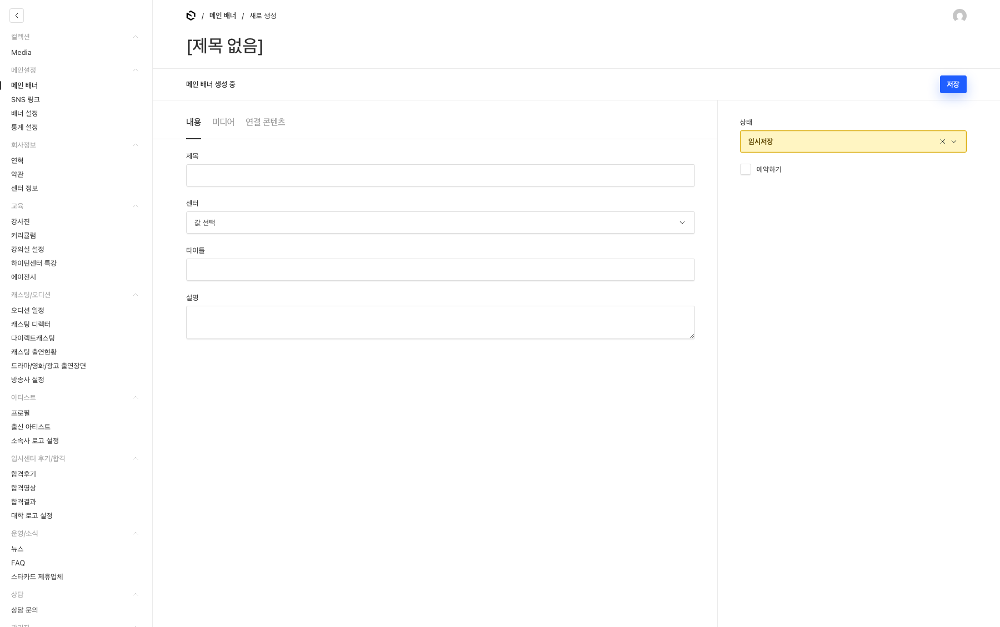

### 센터별 연결 콘텐츠

| 센터 | 연결 방식 |
| --- | --- |
| 입시센터 | 대학 또는 직접 노출 문구를 정하고, 그 아래에 여러 합격후기를 연결합니다. |
| 그 외 센터 | 프로필을 선택하고 역할 또는 노출 문구를 입력합니다. |

입시센터 배너에서 대학 로고가 검색되지 않으면 먼저 **입시센터 후기/합격 → 대학 로고 설정**에 학교를 등록합니다. 대학 로고를 사용하지 않는 문구형 배너는 `직접 노출 문구`를 입력합니다.

배너의 센터를 바꾸면 기존 센터에 맞춰 연결한 콘텐츠가 초기화됩니다. 확인 창의 내용을 읽고 계속 진행할 때만 센터를 변경합니다.

### 예약 노출

1. 상태를 **공개**로 설정합니다.
2. **예약하기**를 켭니다.
3. 예약 시작일을 입력합니다.
4. 예약 종료일을 입력합니다.
5. 저장 후 예약 기간이 맞는지 다시 확인합니다.

상태가 공개여도 예약 기간 전이나 종료 후에는 배너가 노출되지 않습니다.

### 배너 복제

비슷한 배너를 만들 때 복제 기능을 사용할 수 있습니다. 복제된 배너는 제목 뒤에 `- 복제됨`이 붙고 **임시저장** 상태가 됩니다. 센터, 이미지, 연결 콘텐츠, 예약 기간을 모두 확인한 뒤 공개합니다.

### 6-2. 배너 순서와 자동 전환

1. **메인설정 → 배너 설정**을 선택합니다.
2. 본인 센터 탭을 엽니다.
3. **오토플레이** 사용 여부를 확인합니다.
4. **전환속도(ms)**를 입력합니다. 예: `5000`은 5초입니다.
5. 배너 배열을 드래그해 실제 노출 순서로 정리합니다.
6. 저장하고 센터 메인에서 첫 배너와 전환 순서를 확인합니다.

센터매니저에게는 담당 센터 탭만 표시됩니다.

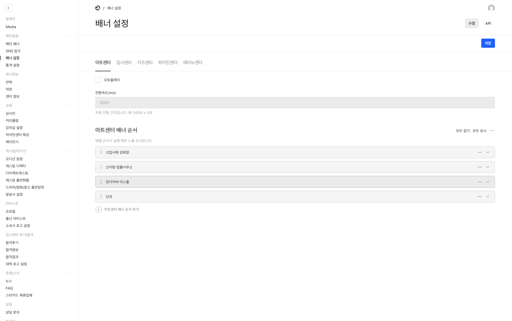

### 6-3. SNS 링크

1. **메인설정 → SNS 링크**를 선택합니다.
2. 관리자 제목, 센터, SNS 타입을 선택합니다.
3. 인스타그램은 게시물 URL과 대표 이미지를 입력합니다.
4. 유튜브는 영상 URL을 입력하고 오른쪽 미리보기를 확인합니다.
5. 상태를 확인해 저장합니다.
6. 해당 센터 메인 화면의 SNS 영역을 확인합니다.

### 6-4. 통계 설정

**메인설정 → 통계 설정**에서는 센터 메인의 누적 작품 수, 이달의 주·조연, 이달의 조·단역 수치를 관리합니다. 모든 값은 0 이상의 정수로 입력합니다.

입시센터 메인에는 현재 이 통계 영역이 노출되지 않습니다. 다른 센터 수치를 수정한 뒤에는 해당 센터 메인에서 숫자와 항목명을 확인합니다.

## 7. 회사정보 관리

회사정보에는 **연혁**, **약관**, **센터 정보**가 있습니다.

### 7-1. 연혁

1. **회사정보 → 연혁**을 선택합니다.
2. 연도별 기존 항목을 검색합니다.
3. 새 연도라면 새 항목을 만들고 **연도**를 입력합니다.
4. 월별 연혁에 월을 입력하고, 그 아래 항목을 추가합니다.
5. 같은 월 안의 항목 순서를 정리한 뒤 저장합니다.
6. `/{센터}/company`의 연혁 영역을 확인합니다.

연혁 제목은 연도를 기준으로 자동 생성됩니다. 같은 연도를 중복 등록할 수 없습니다.

### 7-2. 약관

1. **회사정보 → 약관**을 선택합니다.
2. 개인정보처리방침 또는 이용약관 기존 항목을 엽니다.
3. 문서 유형, 시행일, 본문을 수정합니다.
4. 저장 후 공개 사이트의 `/privacy` 또는 `/terms`를 확인합니다.

문서 유형별 항목은 하나만 유지합니다. 새 항목을 중복 생성하기보다 기존 문서의 버전을 수정합니다.

### 7-3. 센터 정보

1. **회사정보 → 센터 정보**를 선택합니다.
2. 담당 센터 행을 펼칩니다.
3. 센터명, URL, 운영등록번호, 주소를 확인합니다.
4. 유튜브, 네이버 블로그, 인스타그램 URL을 입력합니다.
5. 저장 후 사이트 푸터와 패밀리사이트 링크를 확인합니다.

센터매니저가 저장해도 다른 센터의 정보는 변경되지 않습니다. 다른 센터 행은 수정하지 않습니다.

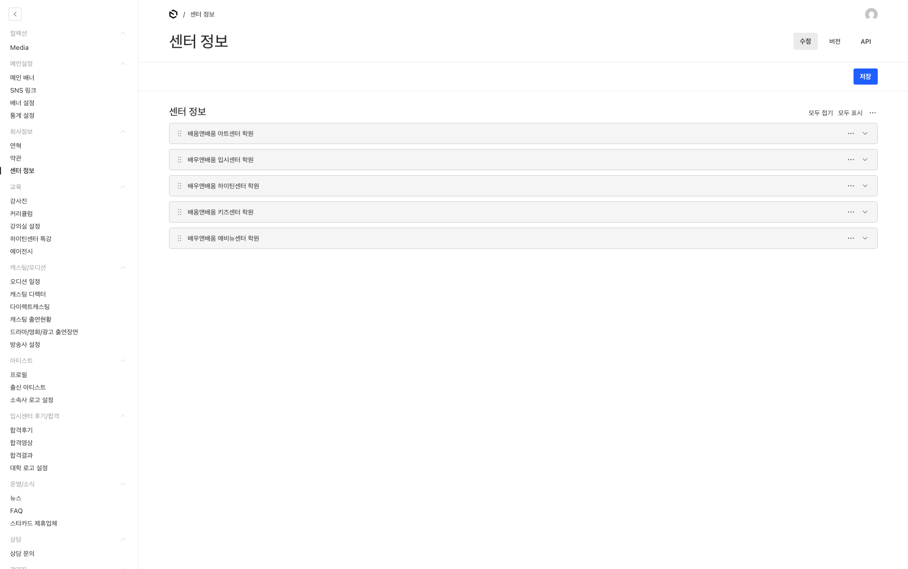

## 8. 교육 콘텐츠 관리

| 메뉴 | 주요 용도 | 공개 확인 위치 |
| --- | --- | --- |
| 강사진 | 강사 소개, 필모그래피, 대표작 | `/{센터}/teachers` |
| 커리큘럼 | 수업 정보와 주차별 강의 | `/{센터}/curriculum` |
| 강의실 설정 | 커리큘럼에서 선택할 강의실과 사진 | 커리큘럼 상세 |
| 하이틴센터 특강 | 하이틴 특강 영상·본문 | `/highteen/special-lecture` |
| 에이전시 | 엔터테인먼트 위탁교육의 회사·출신 배우 | `/{센터}/entertainment` |

### 8-1. 강사진

1. **교육 → 강사진**에서 이름을 검색해 중복 여부를 확인합니다.
2. 이름, 직함, 전공·학교를 입력합니다.
3. 프로필 이미지를 선택하고 필요하면 갤러리 이미지를 업로드합니다.
4. `필모그래피` 탭에서 타이틀과 내용을 추가합니다.
5. `대표작` 탭에서 제목, 포스터, 설명을 추가합니다. 대표작은 최대 8개입니다.
6. 오른쪽에서 센터, 정렬순서, 상태를 확인해 저장합니다.
7. 강사진 목록과 상세 화면을 확인합니다.

새 대표작 포스터는 **포스터 이미지 업로드**를 사용합니다. 기존 데이터의 `포스터 이미지` 경로는 레거시 항목이므로 신규 등록에는 사용하지 않습니다.

### 8-2. 강의실 설정

커리큘럼에서 강의실을 선택하기 전에 **교육 → 강의실 설정**에 강의실을 등록합니다.

1. 강의실명을 입력합니다.
2. 강의실 사진을 한 장 이상 업로드합니다. 여러 장을 한 번에 선택할 수 있습니다.
3. 저장합니다.

### 8-3. 커리큘럼

커리큘럼 등록 전 강사와 강의실이 먼저 등록되어 있어야 합니다.

1. **교육 → 커리큘럼**에서 새 항목을 만듭니다.
2. 커리큘럼 명과 센터를 선택합니다.
3. 선택한 센터에 맞는 클래스와 강사를 선택합니다.
4. 정원, 강의실, 수강료를 입력합니다.
5. 수업요일과 시작·종료 시간을 입력합니다.
6. 교육 시작일을 선택합니다.
7. `커리큘럼` 탭에서 주차별 강의주제와 강의내용을 입력합니다.
8. 저장 후 목록과 상세 화면을 확인합니다.

센터를 먼저 선택해야 해당 센터에서 사용할 수 있는 클래스와 강사가 정확히 표시됩니다. 수강료는 숫자로 입력하며 공개 화면의 금액 표기를 확인합니다.

아트센터, 하이틴센터, 애비뉴센터 커리큘럼은 선택한 센터의 공개 페이지에 자동 노출됩니다. 입시센터와 키즈센터 커리큘럼 공개 페이지는 정적 콘텐츠로 운영되므로, 관리자에 등록한 항목은 분류·보관용이며 공개 페이지에 자동 노출되지 않습니다. 입시센터나 키즈센터 공개 내용을 바꿔야 하면 사이트 관리 담당자에게 요청합니다.

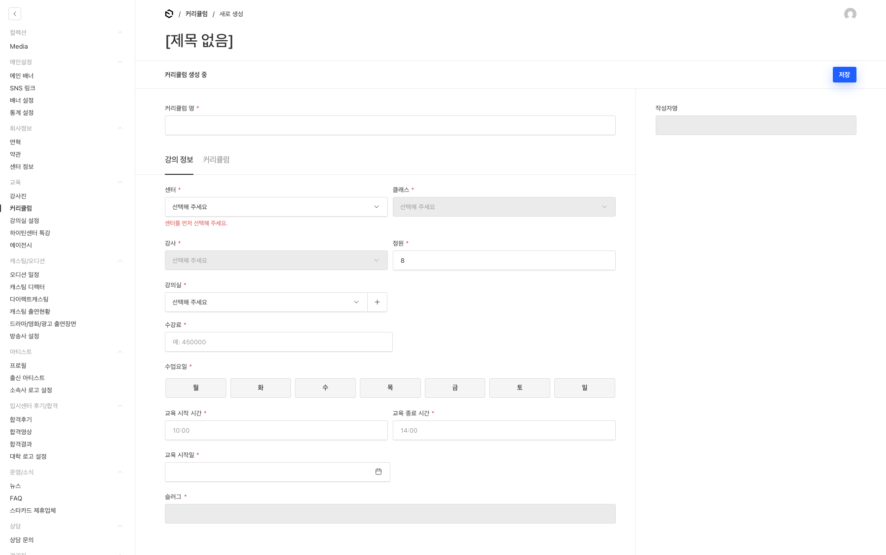

### 8-4. 하이틴센터 특강

이 메뉴는 하이틴센터 담당자와 통합 관리자에게만 보입니다.

1. 제목과 유튜브 URL을 입력합니다.
2. 대표 이미지를 선택합니다. 비워두면 유튜브 썸네일이 사용됩니다.
3. 영상 미리보기를 확인하고 본문을 입력합니다.
4. 상태와 발행일을 확인해 저장합니다.

### 8-5. 에이전시

에이전시는 모든 센터에 공통으로 노출되는 회사 정보입니다. 등록·수정은 통합 관리자만 할 수 있습니다.

1. 회사명과 영문명을 입력합니다.
2. 회사 로고와 요약을 입력합니다.
3. `출신 배우`에 이름과 기수를 추가합니다.
4. 상태와 정렬순서를 확인해 저장합니다.
5. `/{센터}/entertainment`에서 회사와 출신 배우를 확인합니다.

## 9. 캐스팅·오디션 콘텐츠 관리

| 메뉴 | 주요 용도 | 공개 확인 위치 |
| --- | --- | --- |
| 오디션 일정 | 촬영·일정·오디션 달력 | `/{센터}/schedule` |
| 캐스팅 디렉터 | 캐스팅 센터의 디렉터 소개 | `/{센터}/casting` |
| 다이렉트캐스팅 | 회사별 캐스팅 작품·항목 | `/{센터}/direct-castings` |
| 캐스팅 출연현황 | 작품 정보와 여러 출연자 | `/{센터}/casting-status` |
| 드라마/영화/광고 출연장면 | 인물별 출연장면과 본문 이미지 | `/{센터}/screen-appearances` |
| 방송사 설정 | 출연장면에서 선택할 방송사와 로고 | 출연장면 목록·상세 |

### 9-1. 오디션 일정

1. 제목과 일정 유형을 입력합니다. 일정 유형은 촬영, 일정, 오디션 중 선택합니다.
2. 시작일과 종료일을 입력합니다. 종료일이 없으면 시작일과 같은 날짜로 저장됩니다.
3. 본문을 입력합니다.
4. 센터, 발행일, 상태를 확인해 저장합니다.
5. 해당 월의 `/{센터}/schedule`을 확인합니다.

### 9-2. 캐스팅 디렉터

1. 이름과 회사를 입력합니다.
2. 프로필 이미지를 선택합니다.
3. 경력에 연도와 내용을 추가합니다.
4. 센터, 발행일, 상태를 확인해 저장합니다.
5. 캐스팅 센터 화면에서 인물과 경력을 확인합니다.

같은 이름의 디렉터는 중복 등록할 수 없으므로 기존 항목을 먼저 검색합니다.

### 9-3. 다이렉트캐스팅

다이렉트캐스팅은 입시센터를 제외한 센터에서 사용합니다. 입시센터 센터매니저에게는 메뉴가 보이지 않습니다.

1. 작품·항목명을 입력합니다.
2. 하나 이상의 회사명과 노출 센터를 선택합니다.
3. 연도와 작품 정보를 입력합니다.
4. 대표 이미지와 본문을 입력합니다.
5. 상태와 발행일을 확인해 저장합니다.
6. 선택한 모든 센터의 목록과 상세 화면을 확인합니다.

대표 이미지는 **536×760px 이상**을 권장합니다.

### 9-4. 캐스팅 출연현황

1. 제목과 대표 이미지를 입력합니다.
2. 캐스팅 상태, 방송사, 제작사, 감독, 작가를 입력합니다.
3. `캐스팅/출연자` 탭에서 캐스팅 회사를 입력합니다.
4. 출연자 행마다 배우 이름, 역할, 출연회차를 입력합니다.
5. 센터, 발행일, 상태를 확인해 저장합니다.

출연회차가 여러 개면 `1,2,5,6`처럼 쉼표로 구분합니다.

### 9-5. 드라마/영화/광고 출연장면

1. 제목과 센터를 선택합니다.
2. 방송사와 출연 유형을 선택합니다.
3. 출연자 입력 방식을 선택합니다.
4. 작품명, 역할, 방영일, 소개 문장을 입력합니다.
5. `미디어` 탭에서 대표 이미지와 본문 이미지를 입력합니다.
6. 발행일과 상태를 확인해 저장합니다.
7. 목록과 상세 화면을 확인합니다.

대표 이미지는 **1120×620px 이상**을 권장합니다.

**프로필 선택**을 사용하면 선택한 센터의 기존 프로필을 여러 명 연결할 수 있습니다. 이 연결은 출연장면에만 저장되며 프로필의 경력관리에는 자동 추가되지 않습니다.

**직접 입력**은 등록된 프로필이 없는 인물을 표시할 때 사용합니다. 출연자명, 반·클래스, 프로필 이미지, 필모그래피를 직접 입력합니다.

### 9-6. 방송사 설정

출연장면에서 방송사가 검색되지 않을 때 먼저 등록합니다.

1. 방송사명을 입력합니다. 예: SBS, MBC, tvN
2. 영문 소문자 슬러그를 확인합니다.
3. 방송사 로고를 선택해 저장합니다.

방송사 로고는 **400×400px 이상의 정사각형 이미지**를 권장합니다.

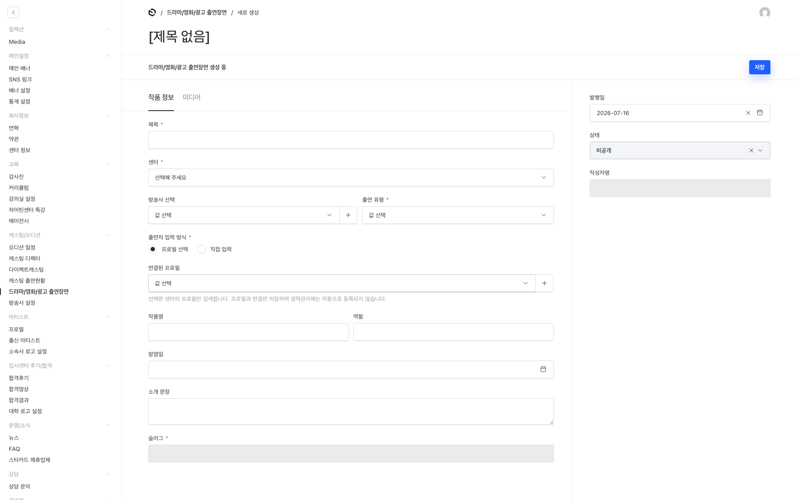

## 10. 아티스트 콘텐츠 관리

아티스트에는 **프로필**, **출신 아티스트**, **소속사 로고 설정**이 있습니다.

### 10-1. 프로필

1. **아티스트 → 프로필**에서 이름을 검색합니다.
2. 새 항목이면 이름과 영문명을 입력합니다.
3. 센터를 먼저 선택하고 해당 센터의 필터를 선택합니다.
4. 키, 몸무게, 반·클래스, 기수를 입력합니다.
5. 프로필 이미지와 갤러리 이미지를 입력합니다.
6. `경력관리` 탭에서 타이틀과 내용을 추가합니다.
7. 발행일과 상태를 확인해 저장합니다.
8. `/{센터}/rookies`와 프로필 상세 화면을 확인합니다.

슬러그는 영문명을 기준으로 자동 입력됩니다. 영문명에는 영문 알파벳, 공백, 콤마만 사용합니다.

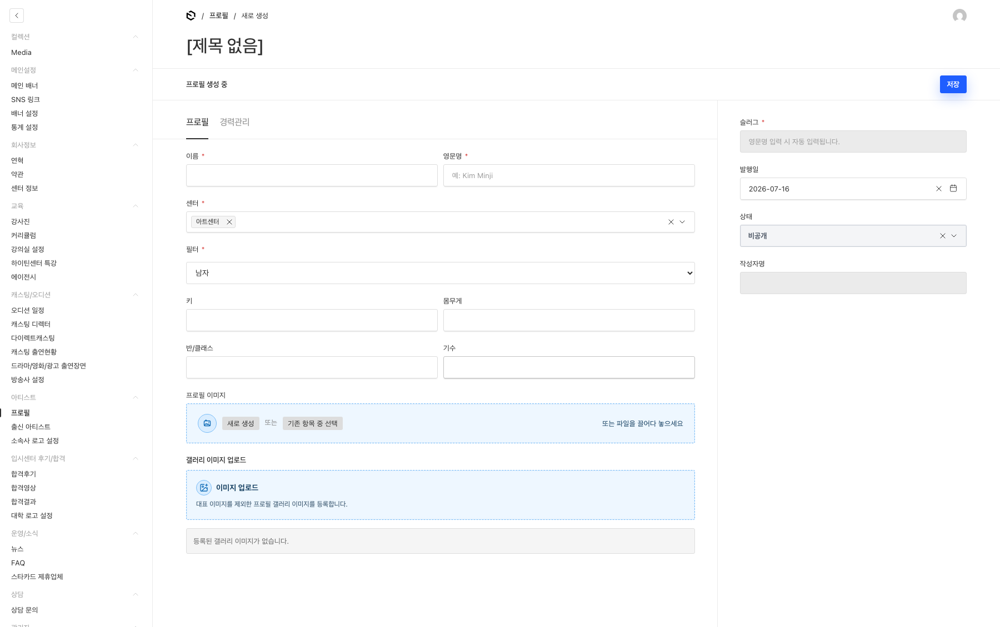

### 10-2. 출신 아티스트

이 메뉴는 아트센터 담당자와 통합 관리자에게만 보입니다.

1. 제목을 입력합니다.
2. 배우명, 소속사, 기수를 입력합니다.
3. 대표 이미지와 소속사 로고를 선택합니다.
4. 본문을 입력합니다.
5. 필요하면 `SEO` 탭의 검색 노출 제목과 설명을 확인합니다.
6. 센터, 발행일, 상태를 확인해 저장합니다.
7. `/{센터}/artist-press` 목록과 상세 화면을 확인합니다.

대표 이미지는 **600×450px 이상**을 권장합니다.

### 10-3. 소속사 로고 설정

출신 아티스트에서 소속사가 검색되지 않거나 로고가 없을 때 등록합니다.

1. 소속사명을 입력합니다.
2. 로고 이미지를 선택합니다.
3. 저장 후 출신 아티스트 편집 화면에서 다시 선택합니다.

소속사 로고는 **400×400px 이상의 정사각형 이미지**를 권장합니다.

이 메뉴도 아트센터 담당자와 통합 관리자에게만 보입니다.

## 11. 입시센터 후기·합격 콘텐츠 관리

입시센터 전용 메뉴는 입시센터 담당자와 통합 관리자에게만 보입니다.

### 권장 등록 순서

새 학교와 합격후기를 메인 배너까지 연결할 때는 아래 순서로 작업합니다.

1. **대학 로고 설정**에 학교와 로고 등록
2. **합격후기**에 학교와 학생 정보 등록
3. 필요하면 **합격영상** 또는 **합격결과** 등록
4. **메인설정 → 메인 배너**에서 학교와 합격후기 연결

### 11-1. 대학 로고 설정

1. 학교명을 검색해 중복 여부를 확인합니다.
2. 학교명과 학교 슬러그를 입력합니다.
3. 로고 이미지를 선택합니다.
4. 저장합니다.

학교 슬러그는 영문 소문자, 숫자, 하이픈만 사용합니다. 예: `seoul-arts`

학교 로고는 **400×400px 이상의 정사각형 이미지**를 권장합니다.

### 11-2. 합격후기

1. 제목을 입력합니다.
2. **학교선택**에서 대학 로고 설정에 등록된 학교를 선택합니다.
3. 학생 이미지와 학생명을 입력합니다.
4. 합격현황과 본문을 입력합니다.
5. 인터뷰가 있으면 질문과 대답을 한 쌍씩 추가합니다.
6. 발행일과 상태를 확인해 저장합니다.
7. `/exam/passed-reviews` 목록과 상세 화면을 확인합니다.

학교가 검색되지 않으면 현재 화면에서 임의로 학교명을 작성하지 말고 대학 로고 설정에 먼저 등록합니다.

### 11-3. 합격영상

1. 제목과 유튜브 URL을 입력합니다.
2. 영상 미리보기가 올바른지 확인합니다.
3. 발행일과 상태를 확인해 저장합니다.
4. `/exam/passed-videos`에서 재생 여부를 확인합니다.

유튜브 코드와 슬러그는 URL을 기준으로 자동 처리되므로 직접 수정하지 않습니다.

### 11-4. 합격결과

1. 제목과 대표 이미지를 입력합니다.
2. 학교 유형을 **대학** 또는 **예술고**로 선택합니다.
3. 본문을 입력합니다.
4. 발행일과 상태를 확인해 저장합니다.
5. 대학은 `/exam/university-results`, 예술고는 `/exam/arts-high-results`에서 확인합니다.

목록 위의 학교 필터로 `전체 / 대학교 / 예술고`를 빠르게 나눠 볼 수 있습니다.

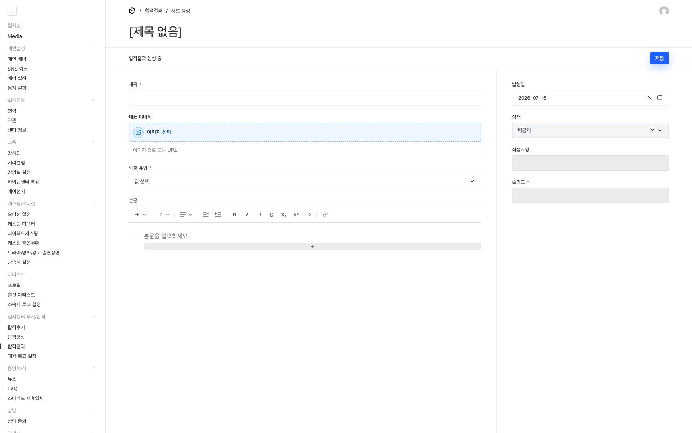

## 12. 뉴스·FAQ·스타카드 관리

### 12-1. 뉴스

1. **운영/소식 → 뉴스**에서 제목을 검색합니다.
2. 새 항목이면 제목을 입력합니다.
3. 센터를 먼저 선택한 뒤 해당 센터에서 사용할 수 있는 분류를 선택합니다.
4. 대표 이미지, 본문, 요약을 입력합니다.
5. 필요하면 `SEO` 탭의 제목, 설명, 이미지를 확인합니다.
6. 상태와 발행일을 확인해 저장합니다.
7. `/{센터}/news` 목록과 상세 화면을 확인합니다.

뉴스는 기존 자료가 많으므로 새로 만들기 전에 제목으로 충분히 검색합니다. 과거 뉴스 수정 시 발행일을 바꾸면 목록 순서가 달라질 수 있습니다.

### 12-2. FAQ

1. **운영/소식 → FAQ**에서 질문을 검색합니다.
2. 질문과 센터를 입력합니다.
3. 분류를 선택합니다.
4. 한 센터이거나 모든 센터에 같은 답을 쓸 때는 **단일 답변**을 입력합니다.
5. 여러 센터에 서로 다른 답을 쓸 때는 **센터별 답변**을 선택하고 센터별 행을 추가합니다.
6. 상태와 노출 순서를 확인해 저장합니다.
7. `/{센터}/faq`에서 질문, 답변, 링크를 확인합니다.

FAQ 답변에서 표는 마크다운 표 형식을 사용합니다. 버튼 링크는 한 줄에 아래처럼 입력합니다.

```markdown
[수강료 안내 바로가기](/art#admission)
```

센터별 답변의 `센터별 질문 문구`는 기본 질문과 다르게 보여야 할 때만 입력합니다.

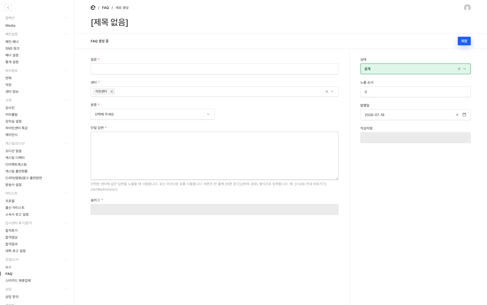

### 12-3. 스타카드 제휴업체

1. **운영/소식 → 스타카드 제휴업체**를 선택합니다.
2. 업체명과 분류를 입력합니다.
3. 지도·외부 링크와 할인율을 입력합니다.
4. 본문을 작성합니다.
5. `이미지` 탭에서 이미지를 한 장 이상 추가합니다.
6. 센터, 상태, 정렬을 확인해 저장합니다.
7. `/{센터}/starcard`에서 분류, 이미지, 할인율, 링크를 확인합니다.

## 13. 상담 문의 관리

상담 문의는 공개 사이트에서 접수된 내용을 확인하고 처리 상태를 기록하는 메뉴입니다. 관리자에서 새 문의를 직접 만드는 메뉴가 아닙니다.

### 문의 확인과 처리

1. **상담 → 상담 문의**를 선택합니다.
2. 최근 접수 순으로 목록을 확인합니다.
3. 신청자 이름 또는 회사명을 선택해 상세 화면을 엽니다.
4. 상단의 `접수 정보`에서 문의 유형, 희망일, 연락처, 경험 정보 등을 확인합니다.
5. 연락처 링크를 선택해 연락하거나 필요한 정보를 내부 절차에 따라 전달합니다.
6. 오른쪽에서 상태를 변경합니다.
7. 처리 내용은 **관리자 메모**에 기록합니다.
8. 저장합니다.

| 상태 | 사용 기준 |
| --- | --- |
| 신규 | 아직 확인하거나 연락하지 않은 문의 |
| 상담중 | 담당자가 확인하고 상담을 진행 중인 문의 |
| 완료 | 상담 또는 제휴 문의 처리가 끝난 문의 |
| 스팸 | 정상 문의가 아닌 항목 |

### 제휴 문의 첨부파일

제휴 문의에 첨부파일이 있으면 `접수 정보`의 파일명을 눌러 다운로드합니다. 관리자 로그인 권한을 확인한 뒤 내려받는 파일이므로 다운로드 주소를 외부에 공유하지 않습니다.

### 개인정보 주의사항

- 연락처, 생년월일, 이메일, 상담 내용은 상담 처리 목적으로만 사용합니다.
- 상담 화면을 캡처해 외부 메신저나 문서에 공유하지 않습니다.
- 첨부파일은 필요한 담당자만 열람합니다.
- 문의 삭제는 회사의 개인정보 보관 기준과 담당자 확인 후 진행합니다.

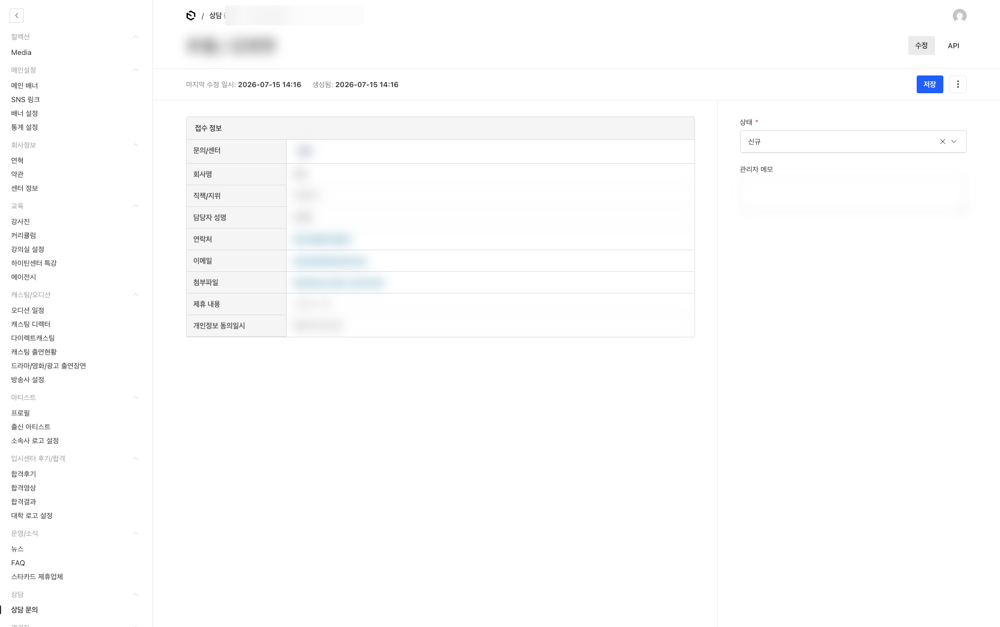

## 14. 관리자 계정과 사이트 점검모드

### 14-1. 관리자 계정

**관리자 → 관리자**에서 계정 정보를 확인합니다.

| 역할 | 화면 표시명 | 권한 |
| --- | --- | --- |
| `master` | 최고관리자 | 전체 관리와 사이트 설정 |
| `admin` | 센터 통합 매니저 | 전체 센터 콘텐츠 관리 |
| `manager` | 센터매니저 | 담당 센터 콘텐츠 관리 |

새 계정 생성, 계정 삭제, 역할·센터 변경은 통합 관리자 권한이 필요합니다. 센터매니저는 본인 계정만 확인·수정할 수 있고 역할과 센터를 바꿀 수 없습니다.

문서가 다른 관리자에 의해 잠겨 있다면 실제 편집 중인지 먼저 확인합니다. **강제 잠금 해제**는 편집자가 없는데 잠금이 비정상적으로 남은 경우에만 사용합니다.

### 14-2. 전체 사이트 점검모드

전체 사이트 점검모드는 서버 점검, 배포 확인, 긴급 장애 대응처럼 방문자의 사이트 이용을 잠시 중단해야 할 때 사용하는 기능입니다. 켜는 즉시 아트·입시·키즈·하이틴·애비뉴센터를 포함한 **모든 공개 페이지가 하나의 점검 안내 화면으로 전환**됩니다. 센터별로 따로 켜거나 특정 페이지만 점검 화면으로 바꾸는 기능은 아닙니다.

이 메뉴는 최고관리자에게만 보입니다.

| 구분 | 점검모드가 켜졌을 때 |
| --- | --- |
| 로그아웃한 일반 방문자 | 접속한 주소와 관계없이 점검 제목, 안내문, 대표전화가 있는 점검 화면을 봅니다. |
| Payload 관리자 | `/admin`에 계속 접속해 콘텐츠와 설정을 관리할 수 있습니다. |
| 로그인한 관리자·센터 계정 | 공개 페이지를 정상 화면으로 볼 수 있습니다. 점검 화면 확인에는 사용하지 않습니다. |
| 검색 엔진 | 점검 중인 페이지를 검색 결과에 새로 수집하지 않도록 임시 비노출 정보가 전달됩니다. |

점검 화면에서는 일반 사이트의 헤더, 푸터, 배너와 콘텐츠가 표시되지 않습니다. **점검 화면 제목**과 **점검 화면 안내문**은 모든 센터에 공통으로 적용되고, 하단에는 대표전화와 고객센터 운영시간이 함께 표시됩니다.

#### 점검모드 켜기 전 준비

1. 실제 점검 시작 시각과 종료 예정 시각을 담당자끼리 먼저 공유합니다.
2. 방문자가 현재 상황을 이해할 수 있도록 제목과 안내문을 작성합니다.
3. 종료 예정 시각을 안내해야 한다면 안내문에 함께 적습니다.
4. 관리자 작업이 끝난 뒤 점검모드를 끌 담당자를 정합니다.

#### 점검모드 켜기

1. **시스템관리 → 사이트 설정**을 선택합니다.
2. **점검 화면 제목**과 **점검 화면 안내문**을 먼저 입력합니다.
3. **전체 사이트 점검모드**를 켭니다.
4. 저장합니다.
5. 로그아웃 상태 또는 시크릿 창에서 서로 다른 센터 주소를 2개 이상 열어 점검 화면이 표시되는지 확인합니다.

로그인한 관리자와 센터 계정은 점검모드 중에도 일반 공개 화면을 볼 수 있으므로, 관리자 로그인 상태의 브라우저만으로 점검 화면 노출 여부를 판단하면 안 됩니다.

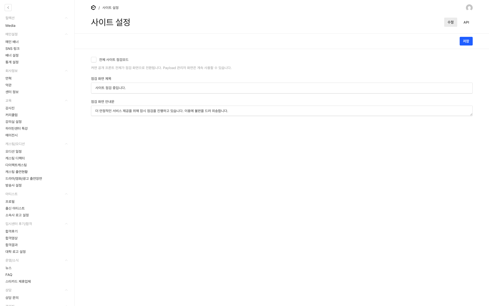

#### 방문자에게 보이는 점검 화면

아래 화면이 일반 방문자에게 표시되는 실제 점검 화면입니다. 제목, 안내문, 대표전화와 운영시간이 맞는지 확인합니다. 점검모드를 켰는데 기존 사이트 화면이 보이면 먼저 로그아웃하거나 시크릿 창에서 다시 접속합니다.

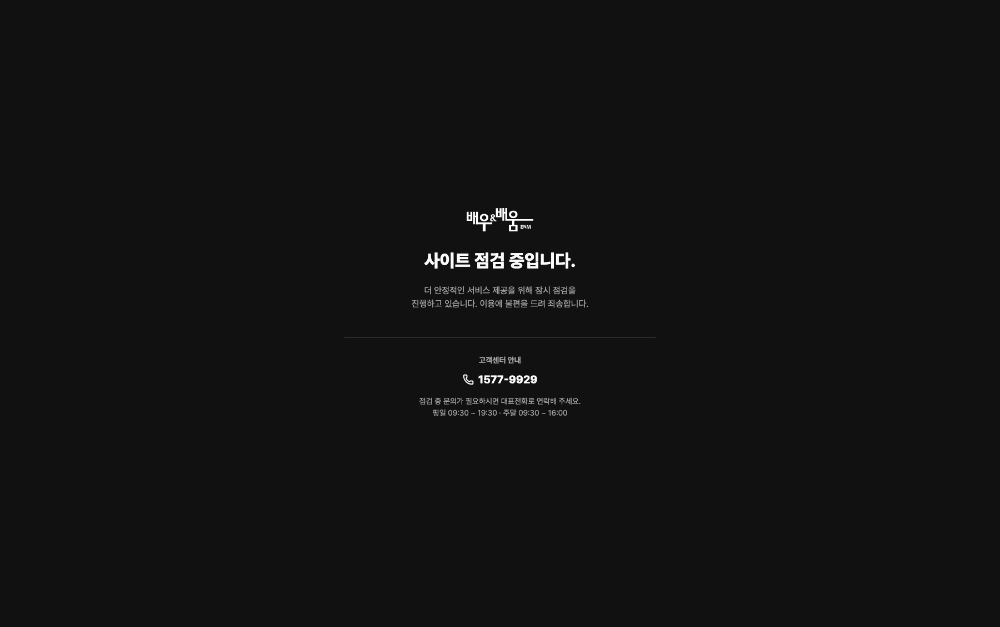

#### 점검모드 끄기

1. **시스템관리 → 사이트 설정**으로 돌아갑니다.
2. **전체 사이트 점검모드**를 끕니다.
3. 저장합니다.
4. 시크릿 창에서 아트·입시·키즈·하이틴·애비뉴센터의 메인 주소를 확인합니다.
5. 모든 센터에서 일반 사이트의 헤더와 콘텐츠가 다시 표시되면 점검 종료를 담당자에게 공유합니다.

점검모드는 저장 즉시 전체 공개 사이트에 영향을 주므로 예약용으로 미리 켜두지 않습니다. 작업이 끝났는데도 끄지 않으면 일반 방문자는 계속 사이트를 이용할 수 없으므로, 해제 확인까지 점검 작업의 일부로 처리합니다.

## 15. 발행 전 확인과 문제 해결

### 발행 전 체크리스트

- [ ] 기존 항목을 검색해 중복 등록이 아닌지 확인했습니다.
- [ ] 제목, 이름, 본문에 오탈자가 없습니다.
- [ ] 담당 센터 또는 의도한 여러 센터를 선택했습니다.
- [ ] 상태가 의도한 값인지 확인했습니다.
- [ ] 발행일과 정렬순서가 기존 목록 순서에 맞습니다.
- [ ] 대표 이미지, 본문 이미지, 로고가 올바르게 선택됐습니다.
- [ ] 저장 완료 안내를 확인했습니다.
- [ ] 공개 사이트의 PC 화면을 확인했습니다.
- [ ] 공개 사이트의 모바일 화면을 확인했습니다.
- [ ] 링크와 유튜브 영상이 실제로 열립니다.

### 자주 발생하는 문제

| 상황 | 먼저 확인할 내용 |
| --- | --- |
| 저장했는데 공개 사이트에 보이지 않음 | 상태가 공개인지, 센터가 맞는지, 발행일 또는 예약 기간이 맞는지 확인합니다. |
| 다른 센터에 노출됨 | 센터 또는 노출 센터 값을 확인하고, 수정 전 센터 화면도 다시 확인합니다. |
| 이미지 업로드가 거절됨 | 이미지가 2MB 이하인지, 지원 형식인지, 확장자와 실제 파일 형식이 같은지 확인합니다. |
| 이미지를 올렸는데 본문에 보이지 않음 | 이미지 선택이 완료됐는지와 콘텐츠 자체를 저장했는지 확인합니다. |
| 메인 배너가 보이지 않음 | 배너 상태, 센터, 예약 기간, 배너 설정의 순서를 확인합니다. |
| 입시 배너에서 학교가 검색되지 않음 | 대학 로고 설정에 학교가 먼저 등록됐는지 확인합니다. |
| 출연장면에서 방송사가 검색되지 않음 | 방송사 설정에 방송사와 로고가 등록됐는지 확인합니다. |
| 커리큘럼에서 강사·강의실이 검색되지 않음 | 센터를 먼저 선택했는지, 강사와 강의실이 먼저 등록됐는지 확인합니다. |
| 수정 전 내용이 계속 보임 | 강력 새로고침 후 다시 확인합니다. 계속되면 콘텐츠 주소와 저장 시각을 전달합니다. |
| 저장 버튼을 눌렀는데 반응이 없음 | 필수값 오류가 있는 탭을 확인합니다. 저장 중 화면이 오래 지속되면 중복 클릭하지 않습니다. |
| 메뉴가 보이지 않음 | 계정 역할과 담당 센터에 따라 숨겨진 메뉴인지 시스템 관리자에게 확인합니다. |
| 문서가 잠겨 있음 | 다른 관리자가 편집 중인지 먼저 확인하고, 실제 편집 중이면 강제 해제하지 않습니다. |

### 지원 요청 시 전달할 정보

문제가 해결되지 않으면 아래 정보를 함께 전달합니다. 비밀번호와 상담 개인정보는 보내지 않습니다.

- 관리자 메뉴명과 콘텐츠 제목
- 공개 사이트 주소
- 작업한 센터
- 수행한 작업 순서
- 오류 문구 또는 개인정보를 가린 화면 캡처
- 저장 또는 오류가 발생한 날짜와 시각

## 16. 빠른 찾기

| 하려는 일 | 관리자 메뉴 | 공개 확인 위치 |
| --- | --- | --- |
| 센터 메인 배너 등록 | 메인설정 → 메인 배너 | `/{센터}` |
| 메인 배너 순서 변경 | 메인설정 → 배너 설정 | `/{센터}` |
| 센터 메인 SNS 등록 | 메인설정 → SNS 링크 | `/{센터}` |
| 메인 통계 숫자 수정 | 메인설정 → 통계 설정 | `/{센터}` |
| 회사 연혁 수정 | 회사정보 → 연혁 | `/{센터}/company` |
| 푸터 주소·SNS 수정 | 회사정보 → 센터 정보 | 모든 공개 페이지의 푸터 |
| 개인정보처리방침·이용약관 수정 | 회사정보 → 약관 | `/privacy`, `/terms` |
| 강사 등록 | 교육 → 강사진 | `/{센터}/teachers` |
| 수업 등록 | 교육 → 커리큘럼 | `/{센터}/curriculum` |
| 강의실 등록 | 교육 → 강의실 설정 | 커리큘럼 상세 |
| 하이틴 특강 등록 | 교육 → 하이틴센터 특강 | `/highteen/special-lecture` |
| 에이전시 등록 | 교육 → 에이전시 | `/{센터}/entertainment` |
| 촬영·오디션 일정 등록 | 캐스팅/오디션 → 오디션 일정 | `/{센터}/schedule` |
| 캐스팅 디렉터 등록 | 캐스팅/오디션 → 캐스팅 디렉터 | `/{센터}/casting` |
| 다이렉트캐스팅 등록 | 캐스팅/오디션 → 다이렉트캐스팅 | `/{센터}/direct-castings` |
| 작품별 출연자 등록 | 캐스팅/오디션 → 캐스팅 출연현황 | `/{센터}/casting-status` |
| 인물별 출연장면 등록 | 캐스팅/오디션 → 드라마/영화/광고 출연장면 | `/{센터}/screen-appearances` |
| 방송사·로고 등록 | 캐스팅/오디션 → 방송사 설정 | 출연장면 목록·상세 |
| 루키 프로필 등록 | 아티스트 → 프로필 | `/{센터}/rookies` |
| 출신 아티스트 등록 | 아티스트 → 출신 아티스트 | `/{센터}/artist-press` |
| 소속사 로고 등록 | 아티스트 → 소속사 로고 설정 | 출신 아티스트 목록·상세 |
| 입시 학교·로고 등록 | 입시센터 후기/합격 → 대학 로고 설정 | 입시 합격 콘텐츠 |
| 합격후기 등록 | 입시센터 후기/합격 → 합격후기 | `/exam/passed-reviews` |
| 합격영상 등록 | 입시센터 후기/합격 → 합격영상 | `/exam/passed-videos` |
| 대학·예술고 합격결과 등록 | 입시센터 후기/합격 → 합격결과 | `/exam/university-results`, `/exam/arts-high-results` |
| 뉴스 등록 | 운영/소식 → 뉴스 | `/{센터}/news` |
| FAQ 수정 | 운영/소식 → FAQ | `/{센터}/faq` |
| 스타카드 제휴업체 등록 | 운영/소식 → 스타카드 제휴업체 | `/{센터}/starcard` |
| 상담 문의 처리 | 상담 → 상담 문의 | 관리자 전용 |
| 관리자 계정 관리 | 관리자 → 관리자 | 관리자 전용 |
| 전체 사이트 점검 전환 | 시스템관리 → 사이트 설정 | 로그아웃·시크릿 창의 공개 사이트 |

## 17. 화면 캡처 목록

아래 파일명으로 캡처하면 본문의 이미지 링크를 별도로 수정하지 않아도 됩니다.

| 번호 | 파일명 | 캡처할 화면 | 캡처 시 주의 |
| ---: | --- | --- | --- |
| 01 | `2-1.png` | 관리자 로그인 | 이메일·비밀번호 입력값 숨김 |
| 02 | `3-1.png` | 로그인 직후 전체 화면 | 계정 이메일 숨김 |
| 03 | `3-2.png` | 목록 검색과 센터 빠른 필터 | 실제 인물명은 필요 시 흐림 처리 |
| 04 | `4-1.png` | 필수값 오류와 편집 화면 | 테스트 콘텐츠 사용 |
| 05 | `05-media-upload.png` | 이미지 선택·업로드 창 | 개인 파일명 숨김 |
| 06 | `06-main-banner.png` | 메인 배너의 내용·미디어·연결 콘텐츠 | 공개 전 테스트 배너 사용 |
| 07 | `07-banner-order.png` | 배너 설정의 센터 탭과 순서 배열 | 다른 센터 설정이 보이지 않게 자르기 |
| 08 | `08-center-info.png` | 센터 정보 행 | 주소 외 내부 정보가 있으면 가림 |
| 09 | `09-curriculum.png` | 커리큘럼 강의 정보 | 수강료가 확정 전이면 테스트 값 사용 |
| 10 | `10-screen-appearance.png` | 출연장면의 프로필 선택·직접 입력 | 공개 가능한 인물만 사용 |
| 11 | `11-profile.png` | 프로필의 센터·필터·이미지 | 공개 가능한 인물만 사용 |
| 12 | `12-exam-content.png` | 학교 선택과 합격 콘텐츠 | 학생 개인정보가 없는 테스트 항목 사용 |
| 13 | `13-faq.png` | FAQ 답변 방식과 센터별 답변 | 실제 운영 문구 사용 가능 |
| 14 | `14-inquiry.png` | 상담 문의 상세 구조 | 모든 개인정보를 반드시 가림 |
| 15 | `15-maintenance.png` | 사이트 설정의 점검모드 | 실제로 켜지 않고 필드 위치만 캡처 가능 |
| 16 | `16-maintenance-page.png` | 전체 사이트 점검 중 방문자 화면 | 제목·안내문·대표전화가 맞는지 확인 |

---

## 문서 관리 메모 (내부용)

- 납품 전 `[운영 도메인]`을 확정된 통합 사이트 주소로 바꿉니다.
- 캡처 이미지는 `deliverables/admin-guide/images/`에 위 파일명으로 저장합니다.
- 캡처 후 이미지가 본문에서 정상 표시되는지 확인합니다.
- 역할별 화면이 다른 항목은 최고관리자 화면만 싣지 말고, 필요하면 센터매니저 화면을 추가합니다.
- 실제 납품 범위에 없는 최고관리자 전용 내용은 클라이언트 역할에 맞춰 삭제하거나 별도 부록으로 분리합니다.
- 관리자 메뉴나 필드명이 바뀌면 해당 절, 빠른 찾기 표, 캡처 목록을 함께 갱신합니다.
